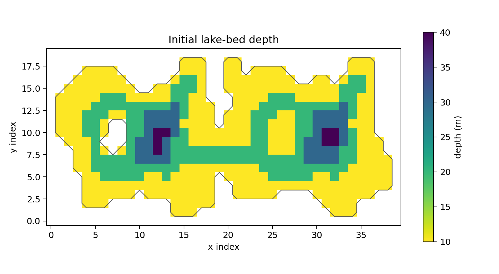
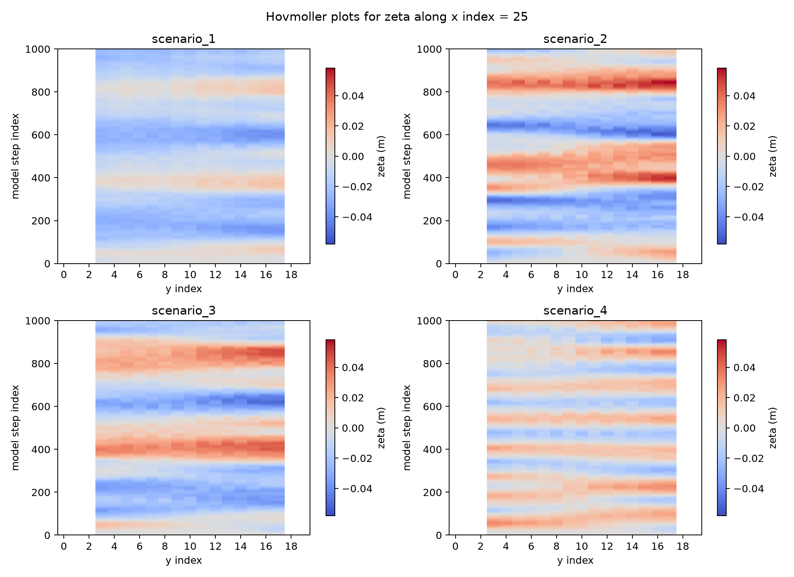
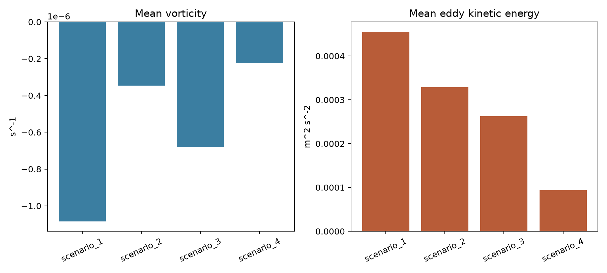
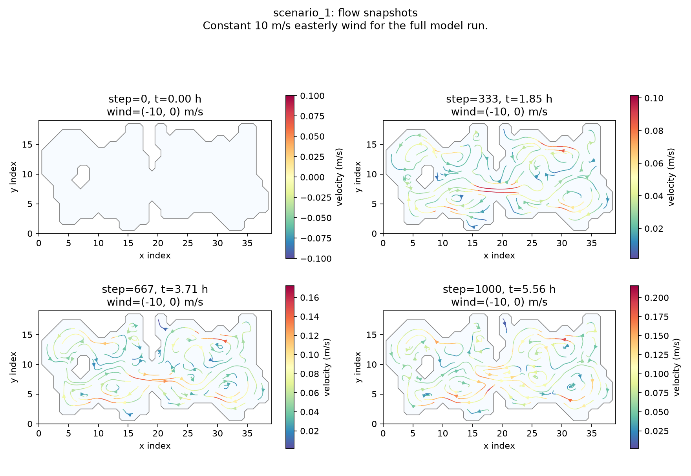
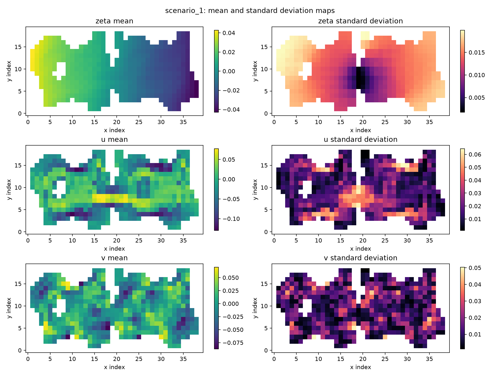
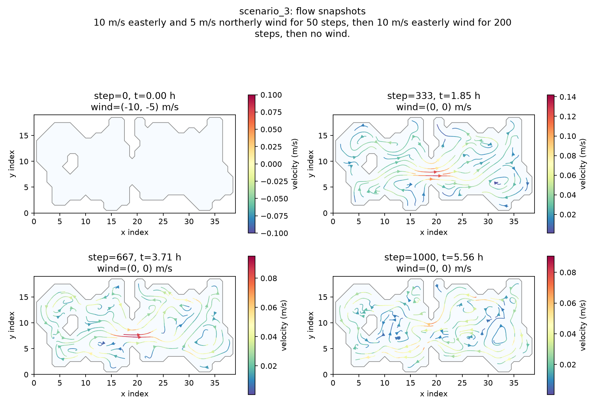
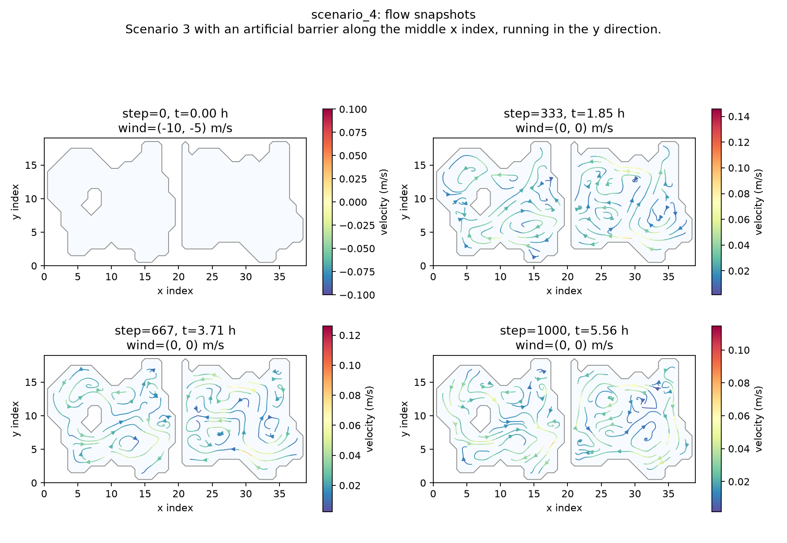
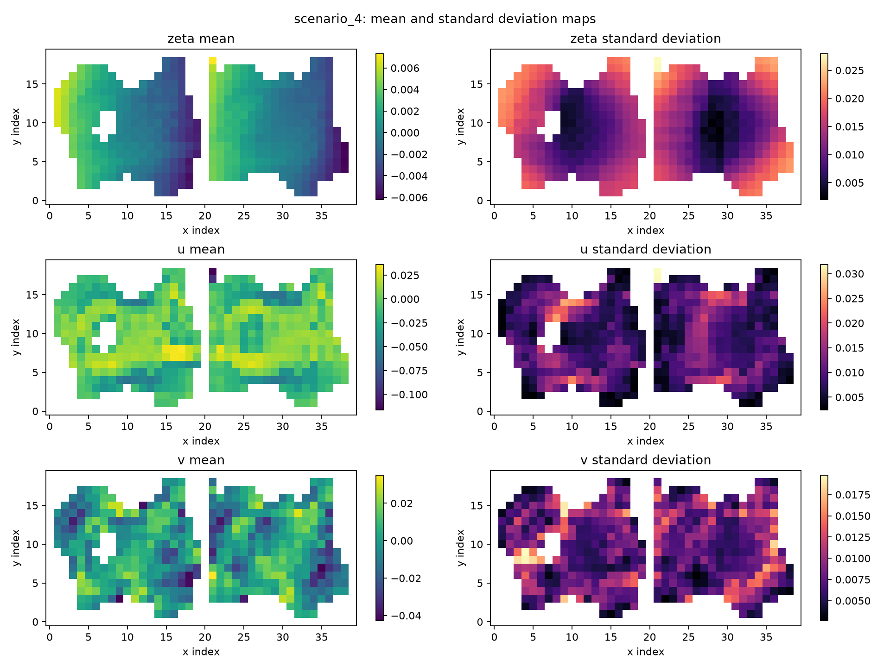
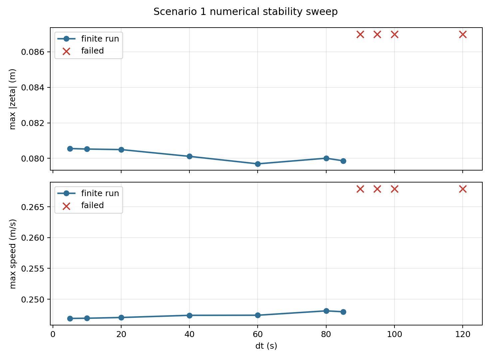

# SWE Lake Model

This project simulates wind-driven circulation in an enclosed lake using the linearized shallow water equations on the supplied bathymetry grid. The model evolves free-surface displacement `zeta` and depth-integrated transports `U` and `V`.

## Lake Setup


## Scenarios

| Scenario | Wind forcing | Geometry |
| --- | --- | --- |
| `scenario_1` | Constant easterly wind: `WX = -10 m/s`, `WY = 0` | Original lake |
| `scenario_2` | `WY = 10 m/s` for 50 steps, then `WX = -10 m/s` for 200 steps, then calm | Original lake |
| `scenario_3` | `WX = -10 m/s`, `WY = -5 m/s` for 50 steps, then `WX = -10 m/s` for 200 steps, then calm | Original lake |
| `scenario_4` | Same wind forcing as `scenario_3` | Artificial land barrier at the middle x-index |

Positive `WX` points eastward and positive `WY` points northward.

## Physical Model

The model uses a depth-averaged shallow-water formulation. The prognostic variables are:

- $\zeta$: free-surface displacement relative to the initial lake level
- $U$: depth-integrated transport in the x direction
- $V$: depth-integrated transport in the y direction
- $H$: still-water depth from the bathymetry grid


## Numerical Pipeline

For each time step, the solver advances the state in this order:

1. Compute `dzeta/dx` and `dzeta/dy` with wet-cell-aware finite differences.
2. Compute quadratic bottom drag from the current transports.
3. Evaluate the wind-stress and Coriolis terms.
4. Update `U` and `V` with explicit Euler time stepping.
5. Mask dry cells so transports over land remain zero.
6. Convert cell-centered transports to face fluxes.
7. Set outer-boundary and wet-land face fluxes to zero.
8. Compute transport divergence from face flux differences.
9.  Update `zeta` with explicit Euler time stepping.

The default grid and time settings are:

$$
\Delta x = 1000\ \mathrm{m}, \qquad
\Delta y = 1000\ \mathrm{m}, \qquad
\Delta t = 20\ \mathrm{s}, \qquad
N_\mathrm{steps} = 1000.
$$

Wind changes are defined by model step index.

## Assumptions

- The model is depth-averaged, so it does not resolve vertical shear, surface Ekman flow, or separate bottom return flow.
- Land cells have `H = 0` and are permanently dry because no land elevation is provided.
- Land behaves like an impermeable barrier; the model does not include wetting and drying.
- Water-land and outer-domain faces use closed-boundary conditions with zero normal transport flux.
- Surface gradients are computed only through connected wet cells, so land is not treated as water with `zeta = 0`.
- Bottom effects are represented by the bathymetry and a simplified quadratic drag term.

## Run

Create and activate a conda environment:

```bash
conda create -n swe-lake python=3.11
conda activate swe-lake
python -m pip install -r requirements.txt
```

Run all scenarios and generate data, summary tables, and figures:

```bash
python -m src.run_all
```

Useful overrides:

```bash
python -m src.run_all --steps 1000 --output-every 5 --dx 1000 --dy 1000
python -m src.run_all --dt 10
python -m src.run_all --output-dir outputs_custom
```

Replay a saved result interactively:

```bash
python -m src.replay_zeta outputs/data/scenario_1.npz
```

Render a compact replay GIF for scenario 1. Sampling every tenth saved frame keeps the animation small enough for the repository while still showing the main circulation evolution:

```bash
python -m src.replay_zeta outputs/data/scenario_1.npz --save-gif assets/results/scenario_1_replay.gif --frame-step 10 --fps 12
```

Render a smoother local-only GIF by reducing `--frame-step`:

```bash
python -m src.replay_zeta outputs/data/scenario_1.npz --save-gif outputs/animations/scenario_1_local.gif --frame-step 2 --fps 20
```

Run the numerical stability sweeps:

```bash
python -m src.stability_experiments
```


## Results


### Cross-Scenario Diagnostics

The Hovmoller plot compares the free-surface response along the selected transect across all four scenarios (x = 25).



The vorticity and eddy kinetic energy summary compares circulation intensity across scenarios.



### Scenario 1

Constant easterly wind over the original lake. The flow develops wind-driven setup, pressure-gradient return flow, and local recirculation controlled by the shoreline.





Compact replay sampled every 10 saved frames:


### Scenario 2

Northward wind is followed by easterly wind and then calm conditions. After the wind stops, residual motion continues as basin-scale adjustment and oscillation.


### Scenario 3

The initial combined easterly and northerly wind produces an oblique setup before the forcing switches to easterly wind and then calm conditions.




### Scenario 4

The artificial land barrier splits the lake into two connected-by-boundary-separated basins, preventing cross-barrier transport and changing the local recirculation pattern.





## Numerical Stability Experiments

The model uses explicit time stepping, so `dt`, `dx`, and `dy` must be chosen consistently. The stability experiments use `scenario_1` as the representative stress case. A run is marked failed when the solver produces non-finite `zeta`, `U`, or `V`.

### Time-Step Sweep

This sweep keeps `dx = dy = 1000 m` and varies `dt`.



The default `dt = 20 s` is comfortably stable in this experiment. The solution remains bounded through `dt = 85 s`, but fails at `dt = 90 s` and above.

### Grid-Spacing Sweep

This sweep keeps `dt = 20 s` and varies `dx = dy`.


At the default `dt = 20 s`, grid spacings of `250 m` and larger stayed finite for the full test. Smaller spacings failed because the same time step becomes too large relative to the grid spacing. The default `dx = dy = 1000 m` is therefore well inside the stable range for this setup.
