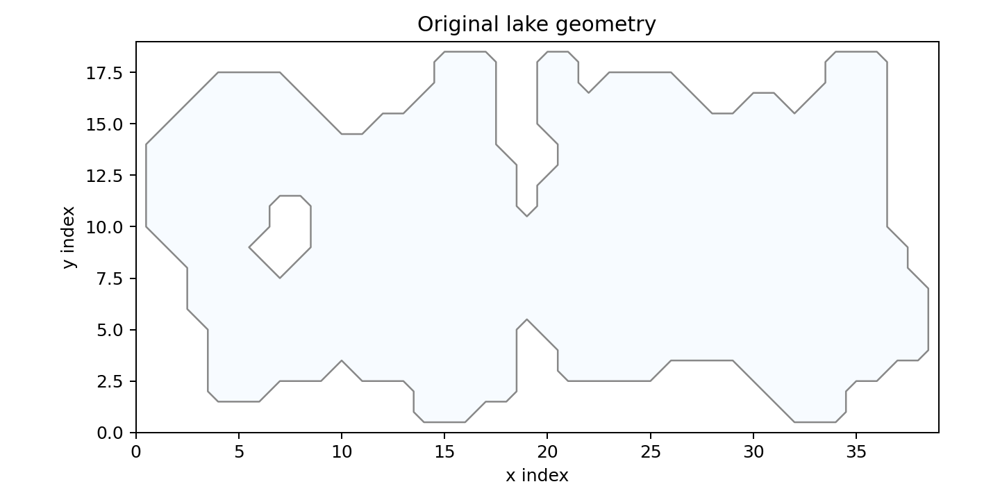

# SWE Lake Model

This project simulates wind-driven depth-averaged circulation in an enclosed lake using the linearized shallow water equations on the supplied bathymetry grid. The model evolves free-surface displacement `zeta` and depth-integrated transports `U` and `V`, then derives velocity, vorticity, eddy kinetic energy, snapshots, and animations from the saved results.

## Lake Setup

The original computational lake mask defines permanently wet cells and impermeable land boundaries.



The initial bathymetry supplies the still-water depth `H` used by the transport and velocity calculations.


## Scenarios

| Scenario | Wind forcing | Geometry |
| --- | --- | --- |
| `scenario_1` | Constant easterly wind: `WX = -10 m/s`, `WY = 0` | Original lake |
| `scenario_2` | `WY = 10 m/s` for 50 steps, then `WX = -10 m/s` for 200 steps, then calm | Original lake |
| `scenario_3` | `WX = -10 m/s`, `WY = -5 m/s` for 50 steps, then `WX = -10 m/s` for 200 steps, then calm | Original lake |
| `scenario_4` | Same wind forcing as `scenario_3` | Artificial land barrier at the middle x-index |

Positive `WX` points eastward and positive `WY` points northward. In these runs, an easterly wind is represented by negative `WX` because it pushes water toward smaller x-index values.

## Physical Model

The model uses a depth-averaged shallow-water formulation. The prognostic variables are:

- $\zeta$: free-surface displacement relative to the initial lake level
- $U = H u$: depth-integrated transport in the x direction
- $V = H v$: depth-integrated transport in the y direction
- $H$: still-water depth from the bathymetry grid

The momentum equations are implemented in the form:

$$
\begin{aligned}
\frac{\partial U}{\partial t}
&= -gH\frac{\partial \zeta}{\partial x}
   - D(U,V)U
   + C_w W_x|\mathbf{W}|
   + fV, \\
\frac{\partial V}{\partial t}
&= -gH\frac{\partial \zeta}{\partial y}
   - D(U,V)V
   + C_w W_y|\mathbf{W}|
   - fU .
\end{aligned}
$$

where:

$$
\begin{aligned}
D(U,V) &= C_d\frac{\sqrt{U^2 + V^2}}{H^2}, \\
|\mathbf{W}| &= \sqrt{W_x^2 + W_y^2}, \\
f &= 2\Omega\sin(\phi).
\end{aligned}
$$

Here $C_w$ is `wind_stress`, $C_d$ is `friction`, and $\phi$ is the model latitude.

The continuity equation updates the free surface from the transport divergence:

$$
\frac{\partial \zeta}{\partial t}
= -\frac{\partial U}{\partial x}
  -\frac{\partial V}{\partial y}.
$$

The diagnostic depth-averaged velocities are computed after the run as:

$$
u = \frac{U}{H}, \qquad v = \frac{V}{H}.
$$

## Numerical Pipeline

For each time step, the solver advances the state in this order:

1. Build the wet-cell mask from `H > 0`.
2. Compute `dzeta/dx` and `dzeta/dy` with wet-cell-aware finite differences.
3. Compute quadratic bottom drag from the current transports.
4. Evaluate the wind-stress and Coriolis terms.
5. Update `U` and `V` with explicit Euler time stepping.
6. Mask dry cells so transports over land remain zero.
7. Convert cell-centered transports to face fluxes.
8. Set outer-boundary and wet-land face fluxes to zero.
9. Compute transport divergence from face flux differences.
10. Update `zeta` with explicit Euler time stepping.
11. Save output frames every `output_every` steps.

The default grid and time settings are:

$$
\Delta x = 1000\ \mathrm{m}, \qquad
\Delta y = 1000\ \mathrm{m}, \qquad
\Delta t = 20\ \mathrm{s}, \qquad
N_\mathrm{steps} = 1000.
$$

Wind changes are defined by model step index, not by physical clock time. With the default `dt = 20 s`, the first 50-step wind phase lasts 1000 seconds.

## Assumptions

- The model is depth-averaged, so it does not resolve vertical shear, surface Ekman flow, or separate bottom return flow.
- Land cells have `H = 0` and are permanently dry because no land elevation is provided.
- Land behaves like an impermeable barrier; the model does not include wetting and drying.
- Water-land and outer-domain faces use closed-boundary conditions with zero normal transport flux.
- Surface gradients are computed only through connected wet cells, so land is not treated as water with `zeta = 0`.
- Bottom effects are represented by the bathymetry and a simplified quadratic drag term.

## Run

Create and activate a conda environment:

```bash
conda create -n swe-lake python=3.11
conda activate swe-lake
python -m pip install -r requirements.txt
```

Run all scenarios and generate data, summary tables, and figures:

```bash
python -m src.run_all
```

Useful overrides:

```bash
python -m src.run_all --steps 1000 --output-every 5 --dx 1000 --dy 1000
python -m src.run_all --dt 10
python -m src.run_all --output-dir outputs_custom
```

Replay a saved result interactively:

```bash
python -m src.replay_zeta outputs/data/scenario_1.npz
```

Render a compact replay GIF for scenario 1. Sampling every tenth saved frame keeps the animation small enough for the repository while still showing the main circulation evolution:

```bash
python -m src.replay_zeta outputs/data/scenario_1.npz --save-gif assets/results/scenario_1_replay.gif --frame-step 10 --fps 12
```

Render a smoother local-only GIF by reducing `--frame-step`. Large GIFs are ignored by default unless explicitly unignored in `.gitignore`:

```bash
python -m src.replay_zeta outputs/data/scenario_1.npz --save-gif outputs/animations/scenario_1_local.gif --frame-step 2 --fps 20
```

Run the tests:

```bash
python -m unittest discover -s tests
```

## Outputs

Running `python -m src.run_all` writes local model outputs under `outputs/`:

- `outputs/summary.csv`
- `outputs/data/scenario_*.npz`
- `outputs/figures/lake_geometry.png`
- `outputs/figures/initial_bathymetry.png`
- `outputs/figures/question_a_point_timeseries.png`
- `outputs/figures/question_c_hovmoller_transect_25.png`
- `outputs/figures/question_e_vorticity_eke.png`
- `outputs/figures/scenario_*_mean_std_maps.png`
- `outputs/figures/scenario_*_flow_snapshots.png`

The repository keeps selected lightweight presentation assets under `assets/results/`:

- original lake geometry and initial bathymetry figures
- cross-scenario Hovmoller and vorticity/EKE figures
- flow snapshots and mean/std maps for all four scenarios
- one compact scenario 1 GIF sampled every 10 saved frames

## Results

The repository keeps the static figures for all scenarios and one compact scenario 1 animation. The raw `.npz` outputs and larger animations are generated locally but ignored by Git.

### Cross-Scenario Diagnostics

The Hovmoller plot compares the free-surface response along the selected transect across all four scenarios.


The vorticity and eddy kinetic energy summary compares circulation intensity across scenarios.


### Scenario 1

Constant easterly wind over the original lake. The flow develops wind-driven setup, pressure-gradient return flow, and local recirculation controlled by the shoreline.


Compact replay sampled every 10 saved frames:


### Scenario 2

Northward wind is followed by easterly wind and then calm conditions. After the wind stops, residual motion continues as basin-scale adjustment and oscillation.


### Scenario 3

The initial combined easterly and northerly wind produces an oblique setup before the forcing switches to easterly wind and then calm conditions.


### Scenario 4

The artificial land barrier splits the lake into two connected-by-boundary-separated basins, preventing cross-barrier transport and changing the local recirculation pattern.


